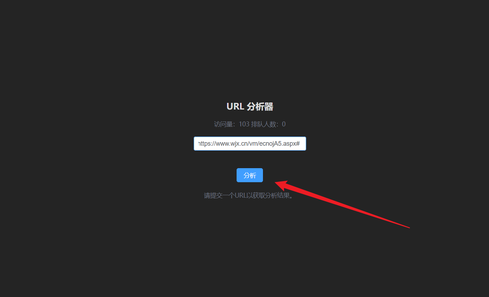

# 问卷星自动化工具
本项目使用Selenium实现问卷星自动化填写，支持Docker容器化部署。
## 使用效果
使用前提:
进入到 use_selenium 目录下:
```
docker-compose up -d
```
这里会启动chrome浏览器和redis服务，并且启动了flask服务，flask服务的端口为5000，redis的端口为6379。
### 无界面模式
直接运行 stream_line.py;需要配置: config.py 中的 task_list
示例:


这个问卷对应的配置如下: 方括号的数字代表每个选项的概率，如[40, 60]代表40%的概率选择第一个选项，60%的概率选择第二个选项。
```task_list = [
    {
        'url': 'https://www.wjx.cn/vm/xxxxxxxxxxxxx.aspx#',
        'prob': {
            "1": [40, 60],
            "2": [30, 40, 30],
            "3": [100],
            "4": [50, 30, 5, 35, 0, 0, 10],
            "5": [25, 30, 20, 25, 0],
            "6": [25, 60, 10, 5],
            "7": [50, 35, 10, 3, 2],
            "8": [20, 40, 5, 80, 35, 25, 25, 55, 5],
            "9": [35, 65],
            "10": [40, 30, 30],
            "11": [40, 10, 10, 40],
            "12": [50, 15, 30, 30, 20],
            "13": [60, 40],
            "14": [10, 70, 10, 10],
            "15": [5, 20, 20, 55],
            "16": [60, 35, 10, 40],
            "17": [50, 35, 30, 20, 0, 80],
            "18": [25, 75],
            "19": [10, 15, 20, 55],
            "20": [35, 60, 0, 5],
            "21": [70, 75, 70, 70, 65, 70, 5],
            "22": [75, 80, 70, 75, 70, 70],
            "23": [50, 20, 20, 15, 40],
            "24": [30, 20, 20, 40, 10, 10, 20, 10],
            "25": [15, 30, 30, 15, 50],
            "26": [55, 50, 50, 5],
            "27": [15, 25, 30, 30],
            "28": [80, 20],
            "29": [85, 15],
            "30": [60, 50, 35, 10, 10, 5],
            "31": [60, 50, 40, 40],
            "32": ["公开课", "正能量的", "符合社会主义核心价值观的", "学校开展的活动", "可以参与动手",
                   "可以学习一些知识", "社会实践课程", "不太清楚", "有趣的"]
        },
        'num': 98\ # 填写次数
    }]
```
    


## 有界面模式
需要进入到my-wjx-vite 目录下:
```angular2html
npm install
npm run dev
```
这样会启动前端

这里可以填比例,数量,同上

## 功能特性

- 支持问卷星自动化填写
- 支持两种问卷格式：
  - 地址中带有/vm/的问卷
  - 地址中带有/vj/的问卷
- 支持题型：
  - 单选题（普通单选、评分单选）
  - 多选题
- 提供Docker容器化部署方案
- 使用Redis进行任务管理

